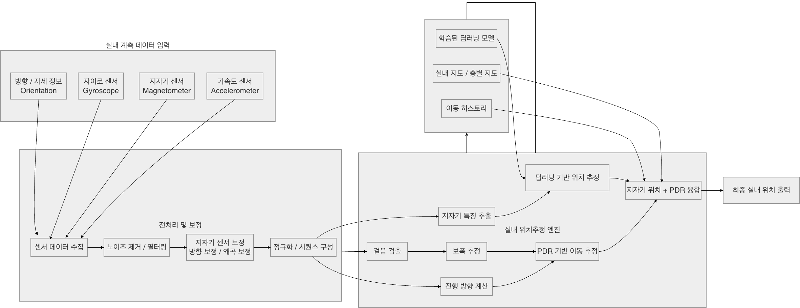

# 🚀 MagNavi
### 지구자기장 기반 실내 통합 내비게이션 시스템

> 실내에서도 GPS처럼 길을 찾을 수 있을까?  
> → 자기장 + 딥러닝 + PDR로 해결한 프로젝트

---

## 📌 프로젝트 개요

MagNavi는 스마트폰 센서만을 활용하여  
실내에서도 정확한 위치를 제공하는 **실내 내비게이션 시스템**입니다.

기존 Wi-Fi, Beacon 기반 실내측위의 한계를 해결하기 위해  
-> **지구자기장 + 딥러닝 + PDR(보행자 추측항법)**을 결합했습니다.

---


## 🏗️ 시스템 아키텍처

<p align="center">
  
</p>
<p align="center">
  
</p>


- Mobile App에서 센서 데이터 수집
- 딥러닝 모델이 위치 예측 수행
- PDR 기반 이동 추정 및 보정
- 최종 실내 위치 반환
  
<p>


</p>
 
---
## 트러블 슈팅 
- 위치 정확도가 높지 않아 원인 분석 및 논문 참고 후, 자기장 왜곡 보정 알고리즘 적용 → 정확도 25% 향상 (72.5% → 97.3%)
- DB 구조 단순화 → 데이터 처리 효율 30% 개선
- AWS EC2 + Git 배포 자동화 → 배포 시간 30% 단축
- 모델 호출 최적화 → 운영 비용 10% 절감
---


## 🎯 개발 배경

- GPS는 실내에서 사용 불가
- Wi-Fi / Beacon 기반 측위는 인프라 비용 + 신호 간섭 문제 존재

➡️ 해결  
-> 스마트폰 센서만으로 위치 추정

---

## 💡 핵심 아이디어

- 실내 공간마다 고유한 자기장 패턴 존재
- 이를 딥러닝으로 학습 → 위치 추정

```
지자기 데이터 → 딥러닝 모델 → 위치 예측
                   +
               PDR 보정
                   ↓
             최종 위치 출력
```

---


## ⚙️ 주요 기능

### 📍 실내 위치 추정
- 지자기 Fingerprinting 기반
- 추가 인프라 없이 구현

### 🧠 딥러닝 기반 위치 예측
- MLP 모델 활용
- 자기장 + 방향 데이터 입력

### 🚶 PDR 기반 이동 추정
- 걸음 수, 보폭, 방향 계산
- 이동 경로 추적

### 🔄 위치 보정
- 지자기 + PDR 결합
- 정확도 향상
---

## 📊 성능

- 정확도: **72.5% → 97.3%**
- 목표 오차: **1m 이내 달성**

---

## 📸 Demo

[Demo 영상](https://www.youtube.com/watch?v=kqR17mF1d1U)

---


## 🏆 성과

- 🥇 캡스톤 디자인 1위  
- 🏆 MIDAS CDP 최우수상  
- 📄 KCI 학술지 게재  🔗 [논문(DBpia)](https://www.dbpia.co.kr/journal/articleDetail?nodeId=NODE12567180) | 
